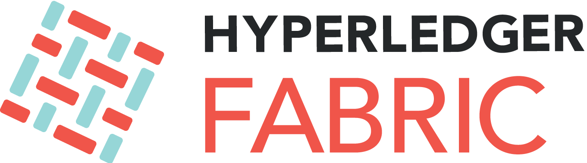
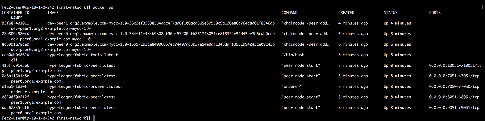

# Amazon Managed Blockchain Basic Introduction Workshop
## Overview

<div align="center">


</div>

[Hyperledger Explorer](https://www.hyperledger.org/projects/explorer) is a blockchain module and one of the Hyperledger projects hosted by The Linux Foundation. Designed to create a user-friendly Web application, Hyperledger Explorer can view, invoke, deploy or query blocks, transactions and associated data, network information (name, status, list of nodes), chain codes and transaction families, as well as any other relevant information stored in the ledger.


## Prerequisites
1. AWS Account


## Step By Step

### Clone This Lab


Download this Project as .zip and extract it as you will need the files in **template** folder

____

### Creating your Infrastructure (CloudFormation)

1. On the **Services** menu, select **CloudFormation**.

2. On the left navigation panel, select **Stacks**, then select **Create Stack**.

3. Select **Template is ready** and **Upload a template file**

	


4. Choose the [fabric-node-template.yaml](templates/fabric-node-template.yaml) code, attached to this project for the template source and click **Next**

5. On the next window, enter name of your cloudformation stack as **Name : `<your network>-Explorer-HLF-Workshop`** and insert your **Managed Blockchain VPC Endpoint**, and specify your **KeyName : `MB-Workshop Key`** file attached to this project file for the instance and click **Next**

	
	
	
6. On the next window leave everything as they are , scroll down and click **Next**,

7. Do the same on the next window and scroll down to click **Create Stack**

8. After that wait for 3-5 minutes for the instances to be launched, and after the stack has been completed, click your stack and pick the **Outputs** tab, to get the url of your instance.

	
	

## Create Your Basic Network


1. SSH into the EC2 instance created from our Cloudformation stack earlier (Make sure you are logged-in as **ec2-user**)

	```
	$ ssh -i "MB-WorkshopKey.pem" ec2-user@ec2-xx-xx-xx-xxx.compute-1.amazonaws.com
	```
	
	>** or enter your key if you specify other key on step 5*
	
2. This instance already contain Hyperledger Fabric Images and the network configuration samples that you will use, so After you logged-in to the instance, enter:

	
	```
	$ cd fabric-samples/first-network
	```
	```
	$ ./byfn.sh generate
	```
	```
	$ ./byfn.sh up
	```
	
	to build the your first network (roughly 3-4 minutes)
	
	>*On certain cases, the network could fail, in that case just retype the* **./byfn.sh up** *command and it would rebuild the network.*
		

3. After it is done it will show a big **END** sign, meaning you have successfully built your first network
	
	
	
	
###OPTIONAL :

4. As our Hyperledger Fabric Network is built with Docker compose, you can see all the infrastructures by entering : 


	```
	docker ps
	```
	
		
	
	
	
	
## Launch an explorer to explore your network
	
1. To configure Hyperledger Explorer you can clone the project through git by entering the command :
	
	```
	git clone https://github.com/hyperledger/blockchain-explorer.git
	```

2. For ease of configurations , we will tell our fabric network configuration through [first-network.json](templates/first-network.json), we would modify this file to suits the configuration of our network.

	First enter the command : 
	
	```
	cd ~/fabric-samples/first-network/crypto-config/peerOrganizations/org1.example.com/users/Admin@org1.example.com/msp/keystore/
	```
	
	And then type in 
	
	```
	ls
	```
	to see name of your keyfile which we would need.
		
	
	Copy your key name and paste it into your own [first-network.json](templates/first-network.json), line 40
	
		
	
	Replace the ```{REPLACE THIS WITH YOUR KEYFILE NAME}``` with your own keyfile name : 
	
		
	
3. Copy the certificates and keys of your network by entering the command : 

	```
	cp ~/fabric-samples/first-network/crypto-config ~/blockchain-explorer/examples/net1/ -r
	```
	
	and then check if your files is already copied :
	
	```
	cd ~/blockchain-explorer/examples/net1/
	```
	
	```
	ls
	```
	Rename the files you just copied by entering command :
	
	```
	rm crypto -r
	mv crypto-config crypto
	```
	and then copy it again for ease of docker-compose :
	```
	cp  ~/blockchain-explorer/examples/net1/crypto /tmp/ -r
	```
	
4. After that , we are going to specify the keychains that would identify and authenticate our Fabric Network  :
	
	```
	cd ~/blockchain-explorer/examples/net1/connection-profile
	```
	
5. We are going to replace the file inside this directory called *first-network.json* with the one with created to specify the correct address.
	
	```
	rm first-network.json
	vim first-network.json
	```
	After entering your vim window, type in the command 
	
	```
	:set nopaste
	```
	And then type `i` to enter insert mode, copy and paste your first-network.json by entering (cmd + c, cmd + v) on mac or just right click on windows, and then type `esc` and enter command `:wq` to save and quit vim window.
	
6. Now we are ready to launch our Explorer go to the correct directory: 

	```
	cd ~/blockchain-explorer/
	```
	
	And launch docker-compose to launch our explorer :
	
	```
	docker-compose up -d
	```
	It will take a few minutes to set up as it is downloading your image files and building the explorer for you, after it is done, open your browser and type in your EC2 URL on the browser and access it through port 8090.
	
		http://ec2-52-207-214-128.compute-1.amazonaws.com:8090	
	
	And type in the user (`admin`) and password as (`adminpw`), your will be brought to the explorer windows.
		
		
	
	
	
	
	
	-------
	
	
## Conclusion

CONGRATULATIONS YOU HAVE LEARNED :

1. Launching Hyperledger Explorer to explore your fabric networks through one node with docker-compose

2. Connecting to your Hyperledger 1.2 Network thru Fabric Node Client inside an EC2 Instance

## Clean Up
To clean up your resources delete the Hyperledger Fabric network managed by Amazon Managed Blockchain and the AWS CloudFormation template as follows:

- In the AWS CloudFormation console **delete the stack** with the stack name `<your network>-Explorer-HLF-Workshop`

## Reference

